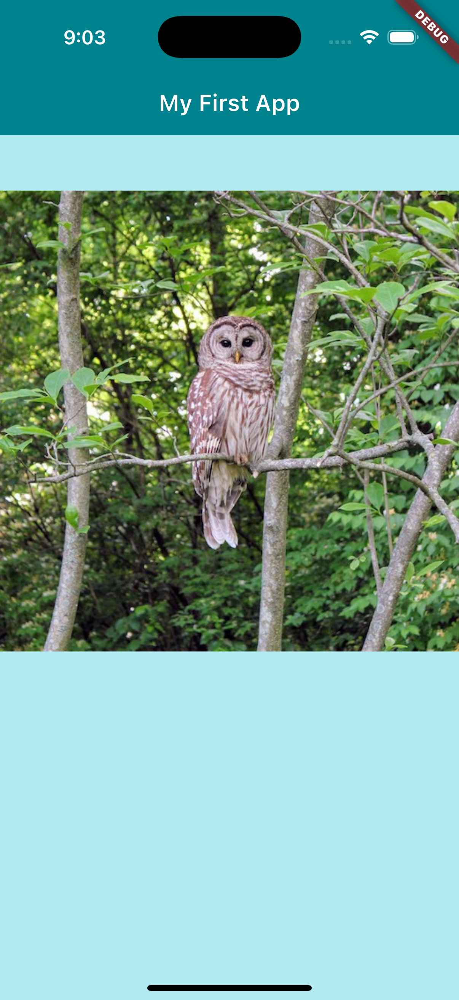

# TuteDude
## File Structure

```
lib/
│   ├── main.dart
│   └── image_application/
│       └── image_application_screen.dart
```

## Image Application

This is the first Flutter application, and it simply renders an image on the screen. The main logic is inside `image_application_screen.dart`.

## Screenshot




