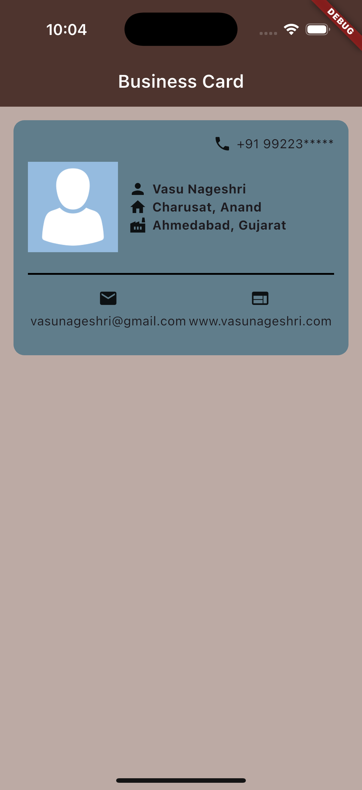
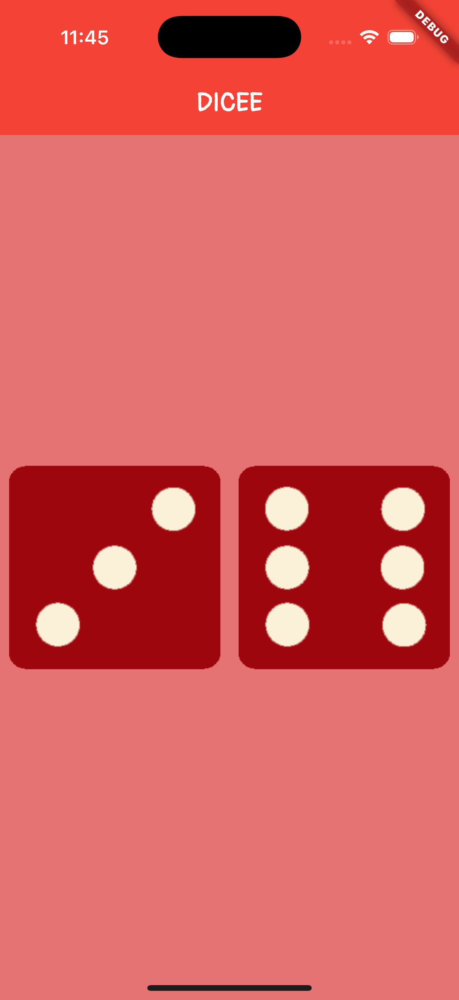
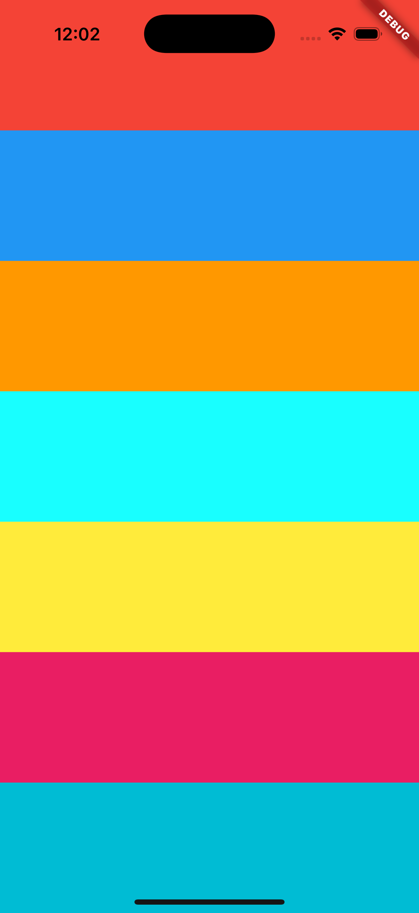
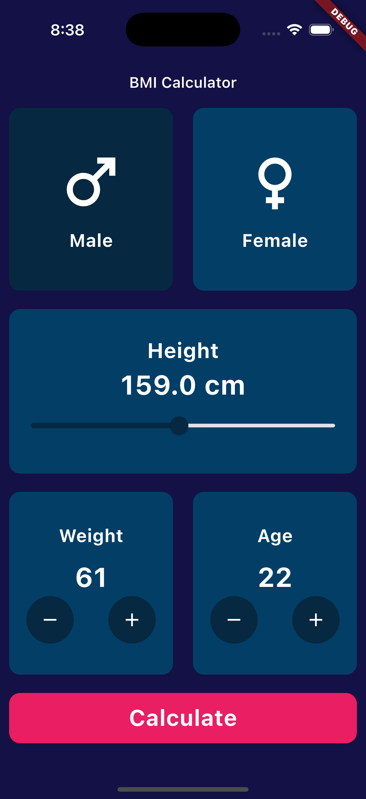
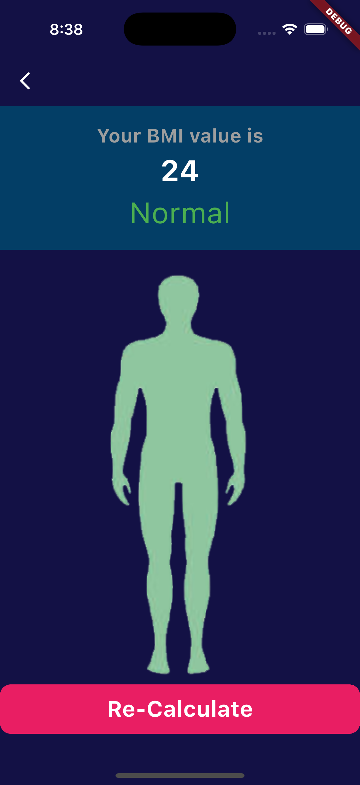
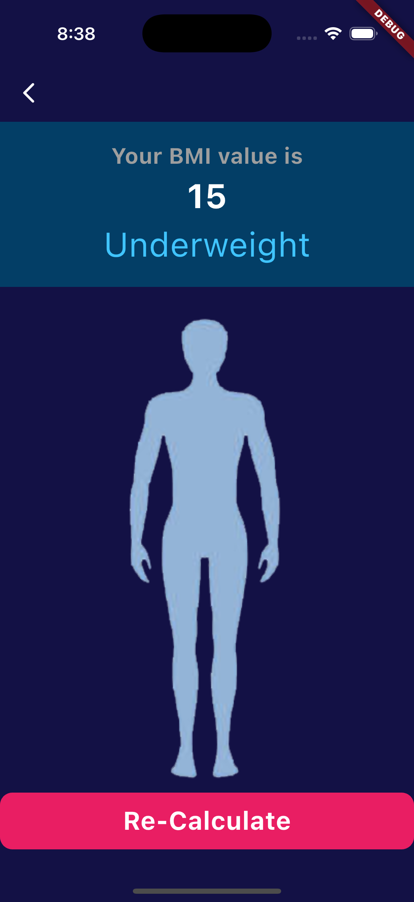
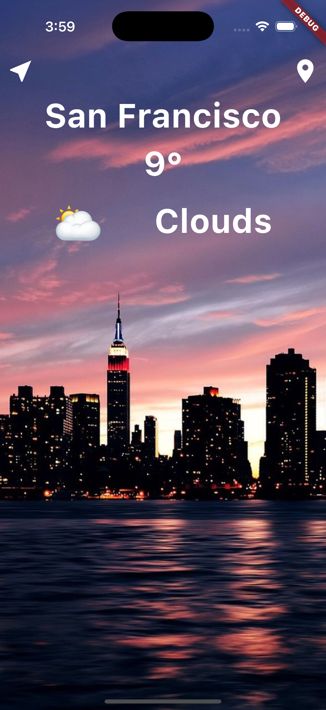
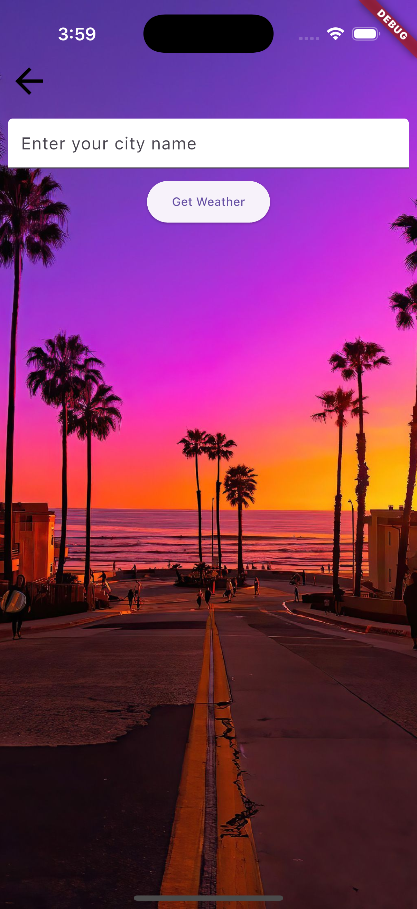
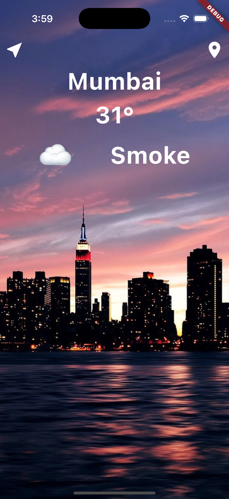

# TuteDude

## File Structure

```
lib/
│   ├── main.dart
│   └── image_application/
│       └── image_application_screen.dart
```

## Image Application

This is the first Flutter application, and it simply renders an image on the screen. The main logic
is inside `image_application_screen.dart`.

## Screenshot


## Personal Business Card Application

This Flutter app also includes a personal business card UI. The main logic is inside
`business_card_screen.dart`. It displays contact details, an avatar, and location information in a
styled card.

## Screenshot



## Dice Application

The Dice application is a fun dice-rolling app where users can tap on the screen to roll two dice
randomly. The main logic is inside `dicee_application_screen.dart`.

## Screenshot



## Xylophone Application

The Xylophone application is an interactive music app that plays different sounds when tapping on
colored bars. The main logic is inside `xylophone_application_screen.dart`. It uses the
`audioplayers` package to play `.wav` files.

## Screenshot



## BMI Calculator

The BMI Calculator app allows users to input their height, weight, and age to calculate their Body
Mass Index (BMI). The main logic is inside bmi_calculator.dart and second_page.dart. The app
dynamically updates the UI based on BMI results and displays a corresponding message and image.

### Features:

**Gender selection**
**Adjustable height, weight, and age**
**BMI calculation and result display with color-coded feedback**
**Navigation to a results page**
## Screenshots
<div style="display: flex; justify-content: center; gap: 10px;">
        
        
        
</div>

## Weather Application (Clima)

The Clima application is a weather app that fetches and displays real-time weather information based on the user's location or a manually entered city name. The main logic is inside screen1.dart and screen2.dart. It utilizes the OpenWeatherMap API to retrieve weather data.

### Features: 

**Current weather display (temperature, condition, and city name)**

**Weather updates based on user location**

**Search functionality to get weather details for a specific city**

**Dynamic weather icons based on weather conditions**

## Screenshots

<div style="display: flex; justify-content: center; gap: 10px;">
        
        
        
</div>